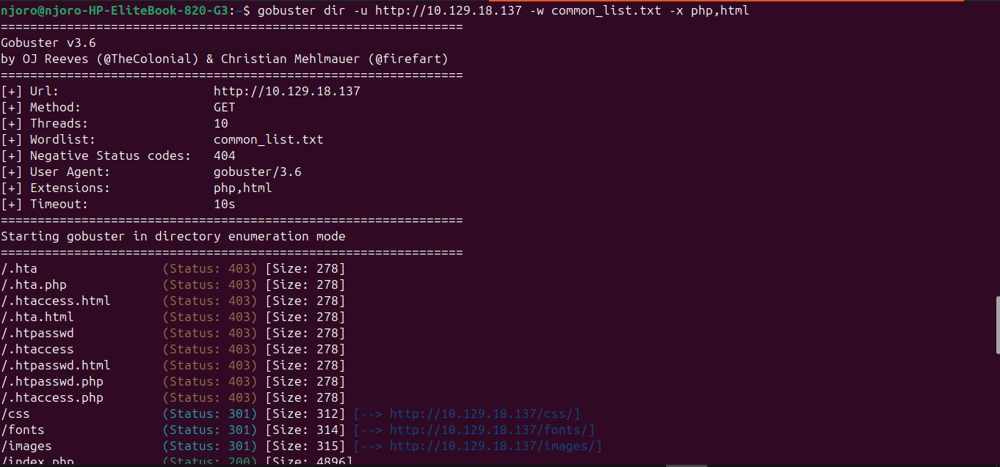
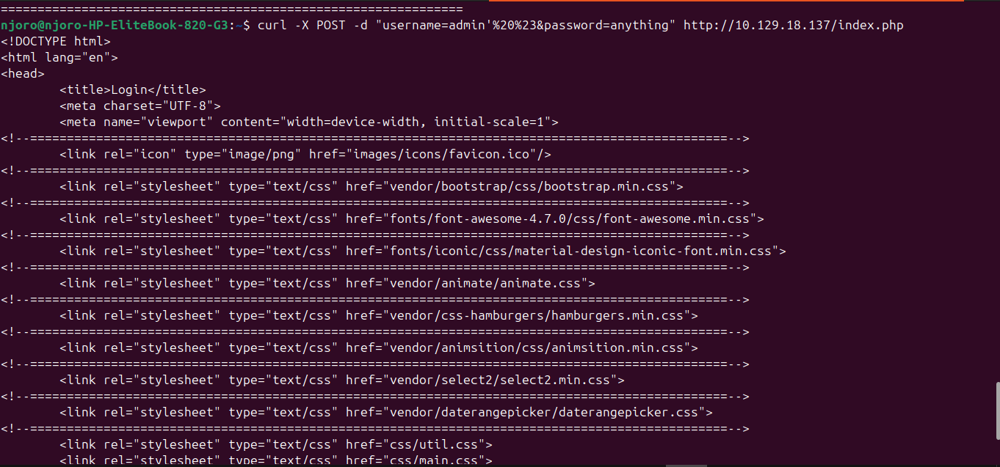

# Project Documentation: Web Application Security Audit & Authentication Bypass via SQLi (HTB: Appointment)

## 1. What Problem Does It Solve?
In modern enterprise applications, user authentication portals act as the primary gatekeeper for sensitive administrative systems. However, if input fields are not properly validated or parameterized, they are susceptible to structural code injection.

This project addresses the operational risks associated with **SQL Injection (SQLi) vulnerabilities leading to Authentication Bypass**. It demonstrates how an attacker can leverage a web directory-busting tool to discover hidden web routing schemas and utilize database structural line comment metacharacters (`#`) to compromise an application's authentication logical structure without requiring valid credentials. Documenting this attack vector allows organizations to analyze insecure source-code parsing and implement secure database query standards.

---

## 2. Tools Used
* **Linux OS (Ubuntu):** The local host deployment framework utilized to manage, configure, and execute the assessment infrastructure.
* **Gobuster (v3.6):** A high-performance URI and directory brute-forcing utility used to map the remote server's hidden web paths.
* **cURL (Client URL):** A robust command-line tool used to assemble and transmit custom HTTP POST request data arrays to the injection target.

---

## 3. What I Did (The Methodology)
I executed a structured three-phase penetration testing methodology against the targeted web environment:
1. **Web Directory Mapping & Enumeration:** Leveraged a local common wordlist containing 4,750 paths combined with explicit extensions (`.php`, `.html`) to scan the target web server. This eliminated blind guessing and localized the functional application routing handler.
2. **Input Vector Assessment:** Identified the entry routing path and evaluated the input processing parameters within the username fields for string manipulation flaws.
3. **Exploitation & Data Exfiltration:** Authored a customized SQL Injection comment string payload and sent it via an automated HTTP POST request to terminate the backend verification query logic, successfully bypassing security checks and extraction of the administrative machine flag token.

---

## 4. What I Found (The Vulnerabilities Discovered)
* **Predictable Web Structure Routing:** The server left critical application frameworks accessible directly via standard index vectors (`/index.php`) mapping standard asset layout directories (`/css`, `/fonts`, `/images`, `/js`, `/vendor`).
* **Insecure Dynamic Database Query Composition:** The authentication processing file handles incoming parameters dynamically without strict type definitions.
* **Arbitrary Statement Execution via Structural Comments:** Passing a single-quote metacharacter (`'`) effectively closed the intended string variable context, and the insertion of a URL-encoded hash tag (`%20%23` -> ` #`) truncated the remainder of the SQL command, forcing the engine to authenticate the session as the administrative profile user (`admin`).

---

## 5. What I Learned
* **The Importance of Path Enumeration Strategy:** Initial manual endpoint targeting (such as `/login.php`) frequently fails due to non-standard naming schemas. Utilizing directory brute-forcing establishes factual awareness of the server's directory layout.
* **Mechanics of Logical SQL Operations:** Understood how database parsers logically evaluate conditional clauses and how structural inline commenting shifts query logic execution paths at runtime.
* **Resource Optimization on Alternative Environments:** Gained experience troubleshooting missing standard utilities on custom Ubuntu installations by dynamically fetching external repositories over safe web streams (`GitHub/SecLists`) to ensure execution continuity.

---

## 6. Skills I Developed
* **Directory Enumeration Automation:** Implementing Gobuster parameters (`-u`, `-w`, `-x`) to discover active files with specific structural extensions (`php`, `html`).
* **Advanced HTTP Payload Delivery:** Mastering command-line manipulation of target requests using raw HTTP verbs (`-X POST`) and parsing arguments (`-d`) via cURL.
* **Web Authentication Bypass Analysis:** Structuring complex database payloads to alter logic validation loops within live web backends.

---

## 7. Evidence of Completion (Proof of Work)

To verify the successful exploitation and execution of this security audit, the following live terminal screenshots were captured during the active testing window:

### Web Path & Directory Discovery
The screenshot below documents the execution of the Gobuster directory enumeration scan. Using the `common_list.txt` file against `http://10.129.18.137`, the application identified a series of style elements alongside the critical structural route target file **`/index.php`** which returned an accessible HTTP `Status: 200`:

### Automated Exploitation & Flag Capture
The second screenshot showcases the final phase of the attack lifecycle. A custom cURL POST payload injects the string statement `username=admin'%20%23` directly into `/index.php`. The server immediately accepts the structural bypass, skips password verification, and outputs the internal landing page content containing the target machine flag:

---

## 8. Hardening & Remediation Recommendations
To protect authentication portals against injection vectors in production environments, implement the following security mitigations:
1. **Implement Prepared Statements (Parameterized Queries):** Use database binding mechanics (such as PHP PDO or prepared SQL statements) to isolate input parameters from application logic. This completely neutralizes structural metacharacters from executing as logic statements.
2. **Enforce Strict Input Validation:** Filter incoming administrative fields via white-lists that strip or reject characters like single-quotes (`'`), semicolons (`;`), or line comment syntax (`--`, `#`).
3. **Deploy Web Application Firewalls (WAF):** Configure an application firewall layer to monitor incoming POST data streams, dynamically dropping requests that present recognizable SQL syntax footprints.