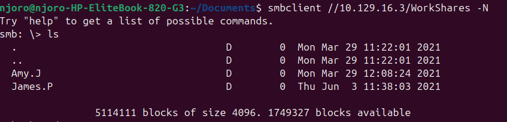
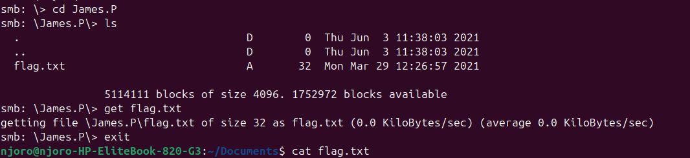

# Project Documentation: SMB Security Audit & Data Exfiltration (HTB: Dancing)

## 1. What Problem Does It Solve?
In enterprise environments, file sharing is necessary for collaboration, but misconfigured network protocols create massive security holes. 

This project addresses the critical risk of **unauthenticated data exposure via the Server Message Block (SMB) protocol**. It demonstrates how an attacker can exploit weak access controls to bypass authentication, map internal network storage structures, browse private directories, and exfiltrate sensitive files without needing a username or password. Identifying these flaws allows organizations to patch them before malicious actors can exploit them.

---

## 2. Tools Used
* **Linux OS (Ubuntu):** The local host deployment platform used to conduct the assessment.
* **Nmap (Network Mapper):** Used for network discovery, active host identification, and port/service version fingerprinting.
* **OpenVPN:** Used to establish a secure, routed network tunnel into the target lab environment.
* **smbclient:** A command-line utility used to query, list, and interact with remote SMB shared folders.

---

## 3. What I Did (The Methodology)
I executed a structured three-phase penetration testing lifecycle against the target host:
1. **Network Reconnaissance:** Ran an active service scan using Nmap to identify network entry points, focusing heavily on ports traditionally allocated for file sharing.
2. **Protocol Auditing:** Probed the discovered SMB service using a "Null Session" technique, forcing the client tool to query the server using completely blank authentication flags to check for administrative oversights.
3. **Active Exploitation:** Bypassed the authentication prompt to gain an interactive command shell inside an unprotected custom network share, systematically navigating the internal directory tree.

---

## 4. What I Found (The Vulnerabilities Discovered)
* **Open File Sharing Architecture:** The target Windows server had legacy NetBIOS (**Port 139**) and modern SMB (**Port 445**) wide open to the network.
* **Null Session Vulnerability:** The server incorrectly accepted unauthenticated connections.
* **Data Leakage:** A custom network directory named `WorkShares` was left completely unprotected. Inside, I exposed two internal user directories (`Amy.J` and `James.P`). The `James.P` folder path contained an unencrypted file named `flag.txt`, allowing for successful data exfiltration.

---

## 5. What I Learned
* **The Danger of Default Settings:** Default system administrative shares (like `C$` and `ADMIN$`) are typically protected, but custom user shares (`WorkShares`) are highly susceptible to human error during configuration.
* **The Value of Null Sessions:** In security auditing, checking for unauthenticated access should always be a high priority during the enumeration phase; sophisticated exploits are unnecessary if the front door is left unlocked.
* **Linux-to-Windows Interoperability:** Mastered how open-source Linux tools seamlessly communicate with proprietary Windows network frameworks using the Samba/SMB engine.

---

## 6. Skills I Developed
* **Network Infrastructure Mapping:** Interpreting complex Nmap service version banners and identifying OS fingerprints.
* **SMB Protocol Enumeration:** Utilizing advanced command-line flags (`-L` and `-N`) to audit network access controls.
* **Command Line Data Exfiltration:** Navigating remote file systems and pulling data packages across network tunnels using interactive non-GUI tools (`get`, `ls`, `cd`).

---

## 7. Evidence of Completion (Proof of Work)

To prove conclusively that this assessment was executed successfully, the following live terminal artifacts were captured during the exploitation phase:

### Network Share Enumeration & Connection Bypassing
The screenshot below documents the initial null session connection to the `WorkShares` directory. It proves full access to the root file structure without any authentication barriers, exposing the internal user folders:

### Targeted Data Extraction
The second screenshot shows the deep directory traversal into the target user profile (`James.P`), the isolation of the target data packet, and the execution of the `get` command to pull the file over the network to the local host machine:

