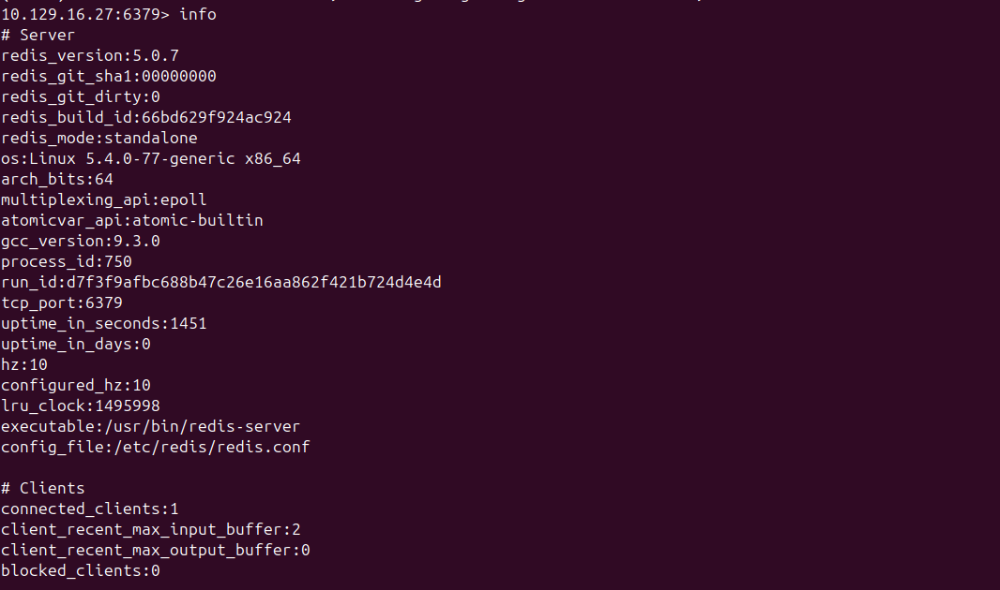
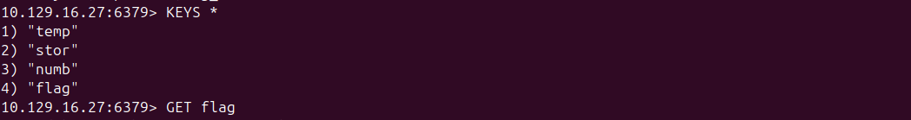

# Project Documentation: Redis Security Audit & Key-Value Data Exfiltration (HTB: Sequel)

## 1. What Problem Does It Solve?
In modern cloud and web architectures, **Redis (Remote Dictionary Server)** is heavily utilized as an in-memory, key-value database cache to accelerate data retrieval. However, due to legacy default installation settings, it is often deployed without an explicit password configuration. 

This project addresses the severe operational risk of **unauthenticated remote code and data access via misconfigured NoSQL engines**. It demonstrates how an external attacker can bypass authentication entirely, probe system memory banners, audit active databases, dump database keyspace elements, and exfiltrate sensitive data parameters (`flag`) over an active network socket. Documenting this attack path enables organizations to audit and harden caching layers against unauthorized enumeration.

---

## 2. Tools Used
* **Linux OS (Ubuntu):** The local host deployment framework utilized to manage and execute the assessment.
* **Nmap (Network Mapper):** Used to perform deep, full-spectrum port scanning to locate services hidden outside standard port ranges.
* **redis-tools (redis-cli):** The native Redis command-line interface utility used to establish interactive communication with the remote instance.

---

## 3. What I Did (The Methodology)
I executed a structured three-phase penetration testing methodology against the targeted deployment:
1. **Full-Spectrum Network Discovery:** Conducted an aggressive Nmap scan sweeping all 65,535 TCP ports (`-p-`) to locate the database engine since it was non-responsive within the standard top 1,000 ports.
2. **Interactive Socket Auditing:** Installed the specialized client packages locally and established an anonymous, unauthenticated remote connection directly to the detected network port interface.
3. **Memory and Keyspace Extraction:** Queried the service infrastructure parameters using low-level engine commands, located the data shards, and isolated and exfiltrated the targeted objective key.

---

## 4. What I Found (The Vulnerabilities Discovered)
* **Exposed Custom Port Bindings:** The target host exposed **TCP Port 6379** (the standard Redis port) directly to the network.
* **Missing Authentication Mechanism (Null Authentication):** The Redis engine was bound to a public-facing network interface without the `requirepass` directive enabled. It completely omitted password checking or authentication flags.
* **Data Leakage in Memory Space:** Anonymous access allowed full exposure of internal keys within database index 0. The system contained sensitive keys labeled `temp`, `stor`, `numb`, and `flag`, permitting instant data exfiltration.

---

## 5. What I Learned
* **The High Cost of Default Configuration Oversights:** Older versions of Redis default to binding to all interfaces without an initial password, relying entirely on perimeter firewall security. If the firewall drops, the database is exposed.
* **NoSQL Enumeration Mechanics:** Mastered the structural differences between auditing relational databases (SQL tables) and non-relational key-value memory blocks.
* **Port Sweeping Precision:** Confirmed that running a default Nmap scan is insufficient; advanced infrastructure profiling demands a full 65,535 port analysis to prevent critical oversights.

---

## 6. Skills I Developed
* **Full-Range Port Enumeration:** Configuring advanced network parameters (`-p-`, `--min-rate`) to map hidden services rapidly.
* **NoSQL Database Exploitation:** Navigating Redis environments natively using direct commands (`info`, `KEYS *`, `GET`).
* **Command-Line Data Exfiltration:** Extracting specific key string allocations directly across remote memory buffers.

---

## 7. Evidence of Completion (Proof of Work)

To verify the successful exploitation and execution of this security audit, the following live terminal screenshots were captured during the active testing window:

### Infrastructure Profile & Service Auditing
The screenshot below confirms the establishment of the unauthenticated session on `10.129.16.27:6379`. The execution of the **`info`** command successfully extracts service variables, proving that the remote standalone Redis engine on Linux is leaking architectural metrics without restriction:

### Keyspace Mapping & Targeted Exfiltration
The second screenshot showcases the final phase of the attack lifecycle. By executing a wildcard query (**`KEYS *`**), the primary database architecture is forced to output all stored keys, revealing the location of the `flag` object. The execution of **`GET flag`** completes the data exfiltration phase over the network channel:

---

## 8. Hardening & Remediation Recommendations
To protect Redis instances against this vector in production networks, implement the following security mitigations:
1. **Enable Authentication:** Uncomment or inject the `requirepass` configuration directive inside the `/etc/redis/redis.conf` file to enforce strong password validation on every connection.
2. **Restrict Interface Bindings:** Ensure Redis only binds to the local loopback address (`bind 127.0.0.1 ::1`) or to trusted internal network interfaces rather than 0.0.0.0.
3. **Disable/Rename Dangerous Commands:** Use the `rename-command` directive to disable high-risk diagnostic operations such as `KEYS`, `FLUSHALL`, and `CONFIG` within production spaces to limit damage during a breach.